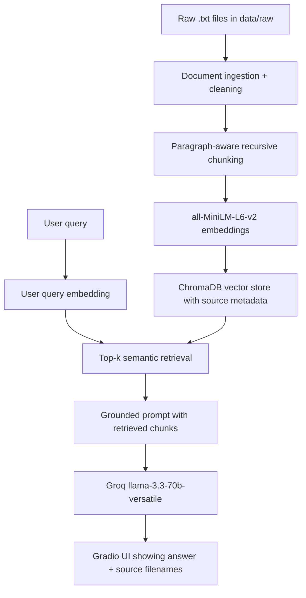

# Project Planning: The Unofficial Guide

## Domain

The domain for this project is Georgia Tech CS course and professor/student experience advice. The system should answer questions about workload, difficulty, exams, projects, course combinations, systems courses, ML courses, and practical student advice.

This knowledge is useful because official course descriptions usually explain catalog topics, but they do not capture what students actually experience in a class. Advice about workload, professor differences, exam style, project intensity, and which classes are hard to combine is scattered across Reddit-style and student discussion threads.

## Documents

1. `01_cs3510_algorithms_topics_study_strategy.txt` - Student discussion summary about CS3510 algorithms topics, proof/pseudocode focus, workload, and study strategy.
2. `02_gt_cs_hard_classes_cs3210_reputation.txt` - Student discussion summary about CS3210's reputation as a difficult upper-level systems course.
3. `03_cs2340_objects_design_difficulty_value.txt` - Student discussion summary about CS2340 Objects and Design, including difficulty, teaching, tests, projects, Android, and group work.
4. `04_cs_schedule_feasibility_1332_2110_2340_3600.txt` - Student advice about whether a schedule with CS1332, CS2110, CS2340, and CS3600 is manageable.
5. `05_course_load_cs2110_cs1332_cs3750_cs2340.txt` - Student discussion summary about combining CS2110, CS1332, CS3750, and CS2340 in one course load.
6. `06_cs1332_cs2110_finals_study_expectations.txt` - Student discussion summary about CS1332 and CS2110 finals, study guides, and exam expectations.
7. `07_cs4641_machine_learning_difficulty_workload.txt` - Student discussion summary about CS4641 Machine Learning difficulty, projects, papers, tests, workload, theory, and statistics background.
8. `08_cs2200_and_cs4641_combined_workload.txt` - Student advice about taking CS2200 and CS4641 together and deciding whether to drop one.
9. `09_cs3210_credit_hours_workload_petition.txt` - Student discussion summary about CS3210 workload, labs, readings, exams, and whether the course credit hours match the effort.
10. `10_cs3210_vs_cs3220_comparison.txt` - Student comparison of CS3210 OS Design and CS3220 Processor Design, including C/kernel work versus Verilog/FPGA work.

## Chunking Strategy

I will use paragraph-aware recursive chunking with a target chunk size around 300-500 words and overlap around 75 words. Each chunk should preserve the source filename and chunk index as metadata.

This fits the corpus because the documents are short but usually contain multiple related points. Chunks that are too small may separate the course name or professor context from the actual advice. Chunks that are too large may mix workload, exams, projects, and scheduling advice in one retrieval result. Paragraph-aware chunking is better than blindly splitting every 500 characters because the student advice is organized in topic-sized paragraphs, and keeping those together should make retrieved context easier for the LLM to use.

## Retrieval Approach

The embedding model will be `sentence-transformers/all-MiniLM-L6-v2`. The vector store will be ChromaDB, and retrieval will use semantic similarity search with an initial `top_k = 5`.

`all-MiniLM-L6-v2` is free, local, and fast enough for this project. ChromaDB is simple to run locally and works well for a small class corpus. `top_k = 5` should give the LLM enough context to compare courses or mention multiple sources without overwhelming the prompt with too much retrieved text.

For a production version, I would compare accuracy, latency, cost, multilingual support, informal language handling, and domain-specific performance. Student discussions can use casual language, abbreviations, and inconsistent phrasing, so a more expensive or domain-tuned embedding model might retrieve better results, but the local MiniLM setup is practical for this milestone project.

## Evaluation Plan

| # | Question                                                       | Expected answer                                                                                                                                                                                   |
| - | -------------------------------------------------------------- | ------------------------------------------------------------------------------------------------------------------------------------------------------------------------------------------------- |
| 1 | What topics do students say are usually covered in CS3510?     | Dynamic programming, divide and conquer, graph algorithms, number theory/graph theory, and NP-completeness are commonly mentioned. Some topics vary by professor.                                 |
| 2 | Is CS3510 more coding-heavy or proof-heavy?                    | Students describe CS3510 as more proof-heavy and pseudocode/math-focused than programming-heavy.                                                                                                  |
| 3 | Why do students say CS4641 can be stressful or time-consuming? | Students mention time-consuming ML assignments/projects, long papers, algorithms that take time to run, broad tests, and the usefulness of statistics background.                                 |
| 4 | Why might taking CS2200 and CS4641 together be difficult?      | CS2200 can require significant reading and fast-paced systems material, while CS4641 has time-consuming ML projects and conceptual work.                                                          |
| 5 | How do students distinguish CS3210 and CS3220?                 | CS3220 is described as processor design with Verilog/FPGA implementation and pipelining, while CS3210 goes deeper into operating systems, C/kernel work, virtual memory, and time-consuming labs. |

## Anticipated Challenges

- Some documents discuss multiple courses at once, so retrieval may return a related but not fully specific chunk.
- Student discussions are subjective and may vary by semester/professor.
- If chunks are too small, the course name may be separated from the actual advice.
- If citations are left only to the LLM, it may omit them, so source filenames should be appended programmatically.

## AI Tool Plan

- Ask Claude Code/Codex to implement ingestion/chunking using the Documents and Chunking Strategy sections.
- Ask Claude Code/Codex to implement ChromaDB embedding/retrieval using the Retrieval Approach section.
- Ask AI to help wire retrieval to Groq and Gradio while enforcing grounded answers.
- Paste tracebacks or bad retrieval examples into AI for debugging.
- Ask ChatGPT to help format README/evaluation results, but only after I provide actual outputs.

## Architecture

